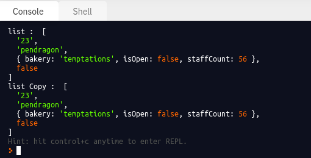

# Copy by value Vs Copy by reference

 

| COPY BY VALUE                                                              | COPY BY REFERENCE                                                                           |
| -------------------------------------------------------------------------- | ------------------------------------------------------------------------------------------- |
| **primitive datatypes** are copied "as a whole value"                      | **non-primitive datatypes** are copied by reference                                         |
| number, string, boolean, etc. for                                          | objects                                                                                     |
|                                      |                                                   |
| If any of the two variables is changed the change doesnt reflect the other | Any change to one object modifies the other, since they are sharing the same memory address |

 

## Note

A variable assigned to an **object** stores not the object itself, but its “address in memory” – in other words “a reference” to it.

When we perform actions with the object, e.g. take a property `user.name`, the JavaScript engine looks at what’s at that address and performs the operation on the actual object.

 
 
 

# How to copy by value a composite data type (array + object)

Copying an object variable creates one more reference to the same object. How to create an independent copy, a clone of the object?

 

## Deepcopy for Objects

We need to create a new object and replicate the structure of the existing one by iterating over its properties and copying them on the primitive level

We have the same employee object with its respective keys and values

 

Now, lets try changing the value of one object

As we can see, none of the properties of the original are getting disturbed

### Object.assign()

We can use the method Object.assign() which returns the deep copy of an object

We can also clone nested object as follows

Object.assign() works for a onject, but not for a JSON object.

 

## Shallow copy for Arrays

The same itterative process can be used to copy Arrays as follows,

We have the same elements with its respective to the original list

Now, lets change the values for the object inside the copy

As we can see, even the object in the original list is getting modified

## Spread Operator - For Shallow copying both Objects and Arrays

To overcome this drawback, ES6 has introduced the spread operator `...` to perform deep copy of composite objects

The spread operator only copies the first level with new reference, but deeper values are still linked together.

 

## Deep copy

- **$.extend**

    Nested Objects

    `let a = { x: {z:1} , y: 2}; `  
    `let b = $.extend(true,{},a); `  
    `b.x.z=0;`  
    `console.log(JSON.stringify(a)); // {"x":{"z":1},"y":2} ` 
    `console.log(JSON.stringify(b)); // {"x":{"z":0},"y":2}` 

    Objects nested in Arrays

    `let a = [{ x:{z:1} , y: 2}];` 
    `let b = $.extend(true, [], a);` 
    `b[0].x.z=0;` 
    `console.log(JSON.stringify(a)); //[{"x":{"z":1},"y":2}]` 
    `console.log(JSON.stringify(b)); // [{"x":{"z":0},"y":2}] `  

- **JSON.parse and JSON.stringify**

    The `JSON.stringify()` method converts a JavaScript value to a JSON string.
    
    The `JSON.parse()` method parses a JSON string, constructing the JavaScript value or object described by the string

    Nested Objects

    `let a = { x:{z:1} , y: 2};` 
    `let b = JSON.parse(JSON.stringify(a));` 
    `b.x.z=0;` 
    `console.log(JSON.stringify(a)); // {"x":{"z":1},"y":2}` 
    `console.log(JSON.stringify(b)); // {"x":{"z":0},"y":2}` 

    Objects nested in Array

    `let a = [{ x:{z:1} , y: 2}];` 
    `let b = JSON.parse(JSON.stringify(a))` 
    `b[0].x.z=0;` 
    `console.log(JSON.stringify(a)); //[{"x":{"z":1},"y":2}]` 
    `console.log(JSON.stringify(b)); // [{"x":{"z":0},"y":2}]` 

- **lodash**
    
    `import _ from "lodash"` 
    `const nestedArray = [[682], [563], [34]]` 
    `const deepCopyWithLodashCloneDeep = _.cloneDeep(nestedArray)` 
    `console.log(nestedArray[0] === deepCopyWithLodashCloneDeep[0])     //false` 